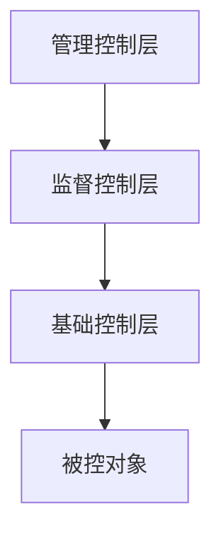

# 提示词模板使用指南

本文档介绍如何使用和管理工业数据分析系统中的提示词模板。

## 概述

为了方便后续的修改和优化，我们将所有的提示词从代码中提取到外部的 Markdown 文件中。这样可以：

- ✅ 无需修改代码即可优化提示词
- ✅ 支持版本控制和协作编辑
- ✅ 提供结构化的模板管理
- ✅ 便于A/B测试和效果对比
- ✅ 支持表格格式和图形化展示

## 提示词模板文件位置

所有提示词模板文件位于 `src/prompts/templates/` 目录下：

### 工业数据分析专用模板

1. **设备列和时间列识别** - `device_time_identification.md` (v1.1)
   - 用于识别工业数据中的设备相关列和时间列
   - 变量：`dataset_name`, `total_columns`, `columns_info`
   - **新特性**：使用表格格式展示识别结果，包含重要程度排序

2. **业务含义分析** - `business_meaning_analysis.md` (v1.1)
   - 用于分析各列在工业业务中的具体含义和价值
   - 变量：`dataset_name`, `user_requirements`, `columns_business_info`
   - **新特性**：专注业务含义识别，移除数据质量评估，使用表格格式展示

3. **控制原理分析** - `control_relationships_analysis.md` (v1.1)
   - 用于分析列之间的控制原理和因果关系
   - 变量：`dataset_name`, `user_requirements`, `device_time_identification`, `business_meaning_analysis`, `correlation_analysis`, `columns_info`
   - **新特性**：支持Mermaid图表展示控制关系和系统架构，作为工业分析流程的最终步骤

### 通用分析模板

- `statistical_analysis.md` - 统计分析提示词
- `business_insight.md` - 商业洞察提示词
- `visualization_analysis.md` - 可视化建议提示词
- `modeling_analysis.md` - 建模建议提示词

## 最新优化特性

### 1. 表格格式输出

所有工业分析模板现在都使用Markdown表格格式输出结果，提供更清晰的数据展示：

```markdown
| 列名 | 业务类型 | 具体含义 | 数据特征 | 业务价值 | 重要程度 |
|------|----------|----------|----------|----------|----------|
| 温度传感器 | 传感器数据 | 监测设备温度 | 连续数值 | 过程控制关键指标 | 高 |
```

### 2. 图形化展示

控制原理分析模板支持Mermaid图表，提供直观的控制关系展示：


### 3. 专业化分工

- **设备时间识别**：专注于列类型识别，提供详细的识别依据分析
- **业务含义分析**：专注于业务理解，不涉及数据质量评估
- **控制原理分析**：专注于控制关系，支持图文并茂的展示，作为工业分析流程的终点

## 模板文件结构

每个模板文件都采用标准的 YAML Front Matter + Markdown 格式：

```markdown
---
name: "模板名称"
type: "模板类型"
category: "分类"
version: "版本号"
description: "模板描述"
variables:
  - 变量1
  - 变量2
tags:
  - "标签1"
  - "标签2"
author: "作者"
created_date: "创建日期"
updated_date: "更新日期"
---

# 提示词标题

## 系统角色
定义AI的角色和专业背景

## 分析任务
描述具体的分析任务

### 数据信息
{变量名} - 动态内容占位符

## 分析要求
详细的分析要求和输出格式

### 结果表格
| 列1 | 列2 | 列3 |
|-----|-----|-----|
| 数据 | 数据 | 数据 |

### 图形展示（如适用）


## 输出要求
对输出质量和格式的要求
```

## 如何修改提示词

### 1. 直接编辑模板文件

```bash
# 编辑设备识别提示词
vim src/prompts/templates/device_time_identification.md

# 编辑业务含义分析提示词
vim src/prompts/templates/business_meaning_analysis.md

# 编辑控制原理分析提示词
vim src/prompts/templates/control_relationships_analysis.md
```

### 2. 修改后自动生效

提示词模板支持热重载，修改后无需重启服务即可生效。

### 3. 版本管理

建议在修改提示词时：
- 更新模板文件头部的版本号
- 更新 `updated_date` 字段
- 在 Git 中提交变更记录
- 记录修改原因和预期效果

## 代码中的使用方式

### 在节点中使用提示词模板

```python
from ..prompts.analysis_prompts import AnalysisPrompts

class AnalysisNodes:
    def __init__(self):
        self.analysis_prompts = AnalysisPrompts()
    
    async def identify_device_time_columns_node(self, state):
        # 使用外部模板，自动生成表格格式结果
        prompt = self.analysis_prompts.get_device_time_identification_prompt(
            dataset_name=state.get('dataset_name'),
            total_columns=len(columns_info),
            columns_info=columns_info_str
        )
        
        messages = [
            SystemMessage(content="系统角色描述"),
            HumanMessage(content=prompt)
        ]
        
        response = await self.reasoning_llm.ainvoke(messages)
        return response.content  # 返回表格格式的结果
    
    async def analyze_control_relationships_node(self, state):
        # 使用控制原理模板，自动生成图表和表格
        prompt = self.analysis_prompts.get_control_relationships_analysis_prompt(
            dataset_name=state.get('dataset_name'),
            user_requirements=state.get('user_requirements'),
            device_time_identification=state.get('device_time_identification'),
            business_meaning_analysis=state.get('business_meaning_analysis'),
            correlation_analysis=str(correlation_analysis),
            columns_info=columns_info_str
        )
        
        response = await self.reasoning_llm.ainvoke(messages)
        return response.content  # 返回包含Mermaid图表的结果
```

### 可用的提示词方法

```python
# 工业数据分析专用（已优化）
prompts.get_device_time_identification_prompt(dataset_name, total_columns, columns_info)
# 返回：表格格式的设备时间列识别结果

prompts.get_business_meaning_analysis_prompt(dataset_name, user_requirements, columns_business_info)
# 返回：表格格式的业务含义分析结果

prompts.get_control_relationships_analysis_prompt(dataset_name, user_requirements, device_time_identification, business_meaning_analysis, correlation_analysis, columns_info)
# 返回：包含Mermaid图表的控制原理分析结果

# 通用分析
prompts.get_statistical_analysis_prompt(data_info)
prompts.get_business_insight_prompt(analysis_results)
prompts.get_visualization_prompt(data_summary)
prompts.get_modeling_prompt(analysis_goal, data_features)
```

## 输出格式示例

### 设备时间列识别输出

```markdown
### 时间列识别结果表

| 列名 | 列类型 | 时间格式 | 示例值 | 识别依据 | 重要程度 |
|------|--------|----------|--------|----------|----------|
| timestamp | 主时间列 | YYYY-MM-DD HH:mm:ss | 2024-01-01 10:30:00 | 列名包含time关键词，datetime类型 | 极高 |
| date_created | 辅助时间列 | YYYY-MM-DD | 2024-01-01 | 列名包含date关键词 | 高 |

### 设备列识别结果表

| 列名 | 设备列类型 | 数据类型 | 唯一值数量 | 示例值 | 识别依据 | 重要程度 |
|------|------------|----------|------------|--------|----------|----------|
| device_id | 设备ID | string | 15 | DEV001 | 列名包含device，唯一值较少 | 极高 |
| temperature | 设备参数 | float | 1250 | 25.6 | 数值类型，唯一值适中 | 中 |
```

### 控制原理分析输出

```markdown
### 控制系统架构图



### 控制变量关系表

| 控制变量 | 被控变量 | 控制原理 | 响应特性 | 控制策略 | 控制效果 |
|----------|----------|----------|----------|----------|----------|
| valve_opening | flow_rate | 阀门开度控制流量 | 快速响应(2-5秒) | PID控制 | 精度±2% |
```

## 备用机制

如果模板文件加载失败，系统会自动使用内置的备用提示词，确保功能正常运行。

## 最佳实践

### 1. 提示词优化原则

- **明确性**：指令清晰明确，避免歧义
- **结构化**：使用表格和图表，便于AI理解和用户查看
- **专业性**：结合领域知识，提供专业指导
- **可视化**：支持图形化展示，提高理解效率
- **可扩展**：预留扩展空间，支持新需求

### 2. 表格设计原则

- 列数适中（5-7列为宜）
- 表头清晰明确
- 数据类型一致
- 包含重要程度排序
- 提供示例值参考

### 3. 图表设计原则

- 使用标准的Mermaid语法
- 图表类型选择合适（flowchart、graph、timeline等）
- 节点命名清晰
- 颜色搭配合理
- 支持复杂关系展示

### 4. 测试和验证

- 修改后进行充分测试
- 验证表格格式正确性
- 检查Mermaid图表渲染
- 对比修改前后的效果
- 收集用户反馈
- 持续迭代优化

### 5. 文档维护

- 及时更新版本信息
- 记录重要变更
- 维护变量说明
- 保持格式一致
- 更新示例内容

## 故障排除

### 常见问题

1. **模板加载失败**
   - 检查文件路径是否正确
   - 验证YAML格式是否有效
   - 查看日志错误信息

2. **变量替换错误**
   - 确认变量名拼写正确
   - 检查变量是否在模板中定义
   - 验证传入的参数类型

3. **表格格式问题**
   - 检查Markdown表格语法
   - 确认列对齐正确
   - 验证特殊字符转义

4. **图表渲染问题**
   - 验证Mermaid语法正确性
   - 检查节点命名规范
   - 确认图表类型支持

5. **提示词效果不佳**
   - 分析AI输出质量
   - 调整提示词结构
   - 增加示例和约束

### 调试方法

```python
# 查看可用模板
prompts.list_available_templates()

# 重新加载模板
prompts.reload_templates()

# 查看生成的提示词
prompt = prompts.get_device_time_identification_prompt(...)
print(prompt)

# 验证表格格式
import re
table_pattern = r'\|.*\|'
tables = re.findall(table_pattern, prompt)
print(f"发现 {len(tables)} 个表格行")

# 验证Mermaid图表
mermaid_pattern = r'```mermaid\n(.*?)\n```'
charts = re.findall(mermaid_pattern, prompt, re.DOTALL)
print(f"发现 {len(charts)} 个Mermaid图表")
```

## 贡献指南

欢迎贡献新的提示词模板或改进现有模板：

1. Fork 项目
2. 创建新的模板文件或修改现有文件
3. 遵循模板格式规范
4. 使用表格和图表提高可读性
5. 添加必要的测试
6. 更新版本号和日期
7. 提交 Pull Request

### 模板贡献检查清单

- [ ] YAML Front Matter 格式正确
- [ ] 版本号已更新
- [ ] 更新日期已设置
- [ ] 使用表格格式展示结果
- [ ] 图表语法正确（如适用）
- [ ] 变量定义清晰
- [ ] 输出要求明确
- [ ] 示例内容完整
- [ ] 文档已更新

---

通过外部化提示词模板并支持表格和图形化展示，我们实现了更灵活、可维护、可视化的工业数据分析系统。如有问题或建议，请及时反馈。 