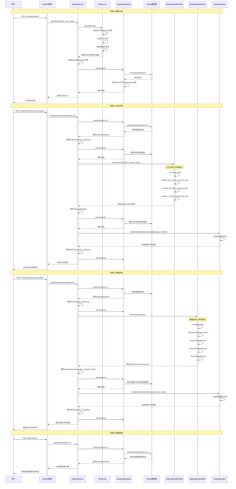
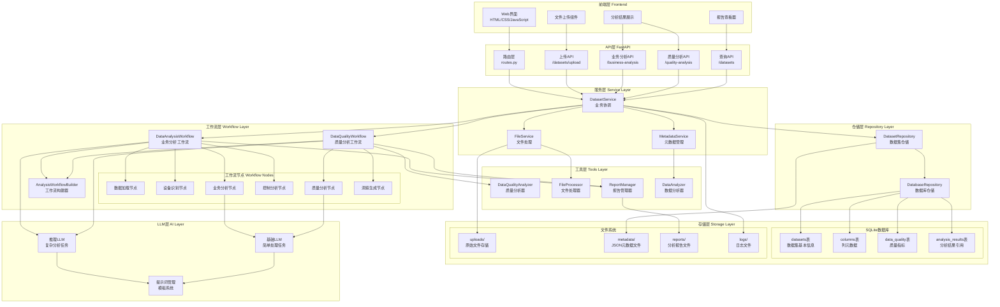
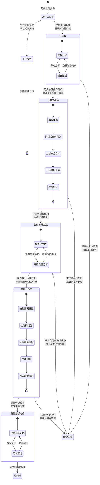

# 数据集管理系统架构文档

## 概述

本文档详细描述了数据集管理系统的架构设计，包括数据流、组件关系、状态管理等核心内容。系统采用分层架构设计，支持从数据上传到业务分析再到质量评估的完整数据处理流程。

## 系统架构概览

### 核心特性
- **分层架构**: 清晰的职责分离和依赖管理
- **混合存储**: SQLite + JSON + Markdown 的多层存储策略
- **工作流驱动**: 基于LangGraph的状态管理工作流
- **AI增强**: 集成LLM进行智能分析和洞察生成

### 技术栈
- **后端**: Python + FastAPI + LangGraph + SQLite
- **前端**: HTML + CSS + JavaScript
- **AI**: LangChain + OpenAI API
- **存储**: SQLite数据库 + 文件系统

## UML架构图

### 1. 类图 - 系统结构

```mermaid
classDiagram
    %% 核心实体类
    class DatasetMetadata {
        +String id
        +String name
        +String description
        +String file_path
        +Integer file_size
        +DateTime upload_time
        +List~ColumnMetadata~ columns
        +List~String~ tags
        +String industry
        +String processing_status
        +Dict quality_analysis_results
        +String device_time_identification
        +String business_meaning_analysis
        +String control_relationships_analysis
    }

    class ColumnMetadata {
        +String name
        +String data_type
        +String business_meaning
        +Boolean is_device_id
        +Boolean is_timestamp
        +Integer null_count
        +Integer unique_count
        +List~String~ sample_values
    }

    class DataQualityReport {
        +String dataset_id
        +String analysis_id
        +DateTime created_at
        +Float overall_score
        +QualityLevel quality_level
        +List~TimeColumnQuality~ time_columns
        +List~ParameterColumnQuality~ parameter_columns
        +List~CategoryColumnQuality~ category_columns
        +List~String~ key_issues
        +List~String~ recommendations
        +Dict summary
    }

    class AnalysisState {
        +String session_id
        +String workflow_type
        +String file_path
        +String dataset_name
        +Dict data_info
        +String current_step
        +List~String~ completed_steps
        +List~String~ errors
        +String basic_analysis
        +String detailed_analysis
        +String device_time_identification
        +String business_meaning_analysis
        +String control_relationships_analysis
    }

    %% 服务层
    class DatasetService {
        -DatasetRepository repository
        -FileService file_service
        -MetadataService metadata_service
        +uploadDataset(file, user_input) String
        +extractMetadata(dataset_id, user_input) Dict
        +startBusinessAnalysis(dataset_id) Dict
        +startQualityAnalysis(dataset_id) Dict
        +getDataset(dataset_id) DatasetMetadata
        +listDatasets() List~DatasetMetadata~
    }

    class FileService {
        -FileProcessor file_processor
        +uploadFile(file) Tuple
        +extractCsvFiles(file_path) List
        +loadCsvData(file_path, sample_rows) DataFrame
    }

    class MetadataService {
        +updateDatasetMetadata(dataset, results) DatasetMetadata
        +extractColumnMetadata(data) List~ColumnMetadata~
    }

    %% 仓储层
    class DatasetRepository {
        -DatabaseRepository db_repository
        -Path metadata_dir
        -Path json_dir
        +save(dataset) void
        +getById(id) DatasetMetadata
        +listAll() List~DatasetMetadata~
        +delete(id) Boolean
    }

    class DatabaseRepository {
        -Path db_path
        +saveDataset(dataset) void
        +getDatasetById(id) DatasetMetadata
        +listDatasets() List~DatasetMetadata~
        +saveAnalysisResult(dataset_id, type, path) void
    }

    %% 工作流层
    class DataAnalysisWorkflow {
        -String workflow_type
        -AnalysisWorkflowBuilder builder
        -StateGraph graph
        +runAnalysis(file_path, dataset_name) AnalysisState
        +runAnalysisStream() AsyncGenerator
    }

    class DataQualityWorkflow {
        -ChatOpenAI llm
        -StateGraph graph
        +runAnalysis(request) QualityAnalysisResponse
        -loadData(state) DataQualityState
        -detectColumnTypes(state) DataQualityState
        -analyzeQuality(state) DataQualityState
        -generateInsights(state) DataQualityState
    }

    class AnalysisWorkflowBuilder {
        -StateGraph graph
        -MemorySaver checkpointer
        +buildWorkflow() StateGraph
        +buildIndustrialAnalysisWorkflow() StateGraph
        +buildCustomWorkflow(template) StateGraph
    }

    %% 工具层
    class DataQualityAnalyzer {
        -DataFrame data
        -Dict column_types
        +loadData(file_path) void
        +autoDetectColumnTypes() Dict
        +analyzeTimeColumn(col_name) TimeColumnQuality
        +analyzeParameterColumn(col_name) ParameterColumnQuality
        +analyzeCategoryColumn(col_name) CategoryColumnQuality
        +generateQualityReport(dataset_id, analysis_id) DataQualityReport
    }

    class ReportManager {
        -Path reports_dir
        -Path industrial_dir
        -Path quality_dir
        +saveIndustrialAnalysisReport(dataset_id, name, results) Dict
        +saveQualityAnalysisReport(dataset_id, report) Path
    }

    %% 关系定义
    DatasetMetadata "1" --> "*" ColumnMetadata : contains
    DatasetService --> DatasetRepository : uses
    DatasetService --> FileService : uses
    DatasetService --> MetadataService : uses
    DatasetRepository --> DatabaseRepository : uses
    DatasetService --> DataAnalysisWorkflow : triggers
    DatasetService --> DataQualityWorkflow : triggers
    DataAnalysisWorkflow --> AnalysisWorkflowBuilder : uses
    DataAnalysisWorkflow --> AnalysisState : produces
    DataQualityWorkflow --> DataQualityAnalyzer : uses
    DataQualityWorkflow --> DataQualityReport : produces
    DataQualityAnalyzer --> DataQualityReport : generates
    ReportManager --> DataQualityReport : saves
    ReportManager --> AnalysisState : saves
```



### 2. 序列图 - 数据流时序



### 3. 组件图 - 物理架构



### 4. 状态图 - 数据集生命周期



## 详细架构说明

### 分层架构设计

#### 1. 前端层 (Frontend Layer)
- **Web界面**: 基于HTML/CSS/JavaScript的用户界面
- **文件上传组件**: 支持CSV和ZIP文件上传
- **分析结果展示**: 动态展示分析进度和结果
- **报告查看器**: 质量报告和业务分析报告的可视化

#### 2. API层 (API Layer)
- **FastAPI框架**: 提供RESTful API接口
- **路由管理**: 统一的请求路由和参数验证
- **异步处理**: 支持长时间运行的分析任务
- **错误处理**: 统一的异常处理和响应格式

#### 3. 服务层 (Service Layer)
- **DatasetService**: 核心业务逻辑协调器
- **FileService**: 文件上传、解压、格式转换
- **MetadataService**: 元数据提取和管理

#### 4. 工作流层 (Workflow Layer)
- **LangGraph引擎**: 基于状态的工作流管理
- **业务分析工作流**: 工业数据专用分析流程
- **质量分析工作流**: 数据质量评估流程
- **节点化设计**: 每个分析步骤独立可控

#### 5. 工具层 (Tools Layer)
- **DataQualityAnalyzer**: 数据质量分析核心工具
- **FileProcessor**: 文件处理和格式转换
- **ReportManager**: 报告生成和管理
- **DataAnalyzer**: 通用数据分析工具

#### 6. 仓储层 (Repository Layer)
- **混合存储策略**: SQLite + JSON + Markdown
- **数据访问抽象**: 统一的数据访问接口
- **事务管理**: 确保数据一致性

#### 7. 存储层 (Storage Layer)
- **SQLite数据库**: 结构化元数据存储
- **文件系统**: 原始文件和报告存储
- **索引优化**: 高效的查询性能

#### 8. LLM层 (AI Layer)
- **多LLM支持**: 推理LLM和基础LLM
- **提示词管理**: 模板化的提示词系统
- **智能分析**: AI增强的数据洞察

### 数据流详细说明

#### 阶段1: 数据上传
1. **文件接收**: 用户通过Web界面上传CSV或ZIP文件
2. **文件处理**: FileService处理文件，提取CSV数据
3. **元数据创建**: 生成基础的DatasetMetadata对象
4. **数据存储**: 
   - SQLite存储结构化元数据
   - JSON文件存储完整对象
   - 原始文件保存到uploads目录
5. **状态更新**: 设置为"已上传"状态

#### 阶段2: 业务分析
1. **工作流启动**: 用户触发业务分析，启动工业分析工作流
2. **数据加载**: 加载CSV数据到内存
3. **设备识别**: 识别设备ID列和时间戳列
4. **业务分析**: 分析各列的业务含义和价值
5. **控制分析**: 分析列之间的控制关系和因果关系
6. **报告生成**: 生成Markdown格式的分析报告
7. **状态更新**: 设置为"业务分析完成"状态

#### 阶段3: 质量评估
1. **工作流启动**: 用户触发质量分析，启动质量分析工作流
2. **列类型检测**: 自动检测或用户指定列类型
3. **质量分析**: 
   - 时间列: 连续性、格式一致性分析
   - 参数列: 数值范围、异常值分析
   - 类目列: 唯一性、分布分析
4. **洞察生成**: 使用LLM生成深度洞察和建议
5. **报告完成**: 生成完整的质量评估报告
6. **状态更新**: 设置为"质量分析完成"状态

### 存储策略详解

#### SQLite数据库结构
```sql
-- 数据集基本信息表
CREATE TABLE datasets (
    id TEXT PRIMARY KEY,
    name TEXT NOT NULL,
    description TEXT,
    file_path TEXT NOT NULL,
    file_size INTEGER NOT NULL,
    upload_time TIMESTAMP NOT NULL,
    processing_status TEXT DEFAULT 'uploaded',
    -- 其他字段...
);

-- 列元数据表
CREATE TABLE columns (
    id INTEGER PRIMARY KEY AUTOINCREMENT,
    dataset_id TEXT NOT NULL,
    name TEXT NOT NULL,
    data_type TEXT NOT NULL,
    business_meaning TEXT,
    is_device_id BOOLEAN DEFAULT FALSE,
    is_timestamp BOOLEAN DEFAULT FALSE,
    -- 其他字段...
    FOREIGN KEY (dataset_id) REFERENCES datasets (id)
);

-- 数据质量表
CREATE TABLE data_quality (
    id INTEGER PRIMARY KEY AUTOINCREMENT,
    dataset_id TEXT NOT NULL,
    overall_score REAL,
    completeness_score REAL,
    consistency_score REAL,
    accuracy_score REAL,
    -- 其他字段...
    FOREIGN KEY (dataset_id) REFERENCES datasets (id)
);
```

#### 文件系统结构
```
dataset-manager/
├── uploads/                    # 原始文件存储
│   ├── [dataset_id]/
│   │   ├── original_file.csv
│   │   └── extracted_files/
├── metadata/                   # 元数据存储
│   ├── datasets.db            # SQLite数据库
│   └── analysis_results/      # JSON分析结果
│       └── [dataset_id].json
├── reports/                   # 报告文件
│   ├── industrial/           # 工业分析报告
│   │   └── [dataset_id]_[name]/
│   │       ├── 01_设备时间列识别.md
│   │       ├── 02_业务含义分析.md
│   │       ├── 03_控制原理分析.md
│   │       └── 00_综合分析报告.md
│   └── quality/              # 质量分析报告
│       └── [dataset_id]_quality_report.md
└── logs/                      # 日志文件
    └── app.log
```

### 工作流设计

#### 业务分析工作流
```python
# 工作流节点序列
load_data_step → identify_device_time_columns_step → 
analyze_business_meaning_step → analyze_control_relationships_step
```

#### 质量分析工作流
```python
# 工作流节点序列
load_data → detect_column_types → analyze_quality → 
generate_insights → finalize_report
```

### 状态管理

#### 数据集状态转换
```
uploaded → business_analyzing → business_completed → 
quality_analyzing → quality_completed
```

#### 错误处理和恢复
- **上传失败**: 清理临时文件，返回初始状态
- **分析失败**: 保留已完成的分析结果，允许重新分析
- **状态回滚**: 支持从失败状态恢复到上一个稳定状态

## 关键设计原则

### 1. 单一职责原则
每个类和模块都有明确的职责边界，便于维护和扩展。

### 2. 依赖倒置原则
高层模块不依赖低层模块的具体实现，通过接口进行交互。

### 3. 开闭原则
系统对扩展开放，对修改关闭。可以轻松添加新的分析类型或存储方式。

### 4. 数据一致性
通过事务处理和状态管理确保多存储层的数据一致性。

### 5. 可观测性
完整的日志记录和状态跟踪，便于问题诊断和性能优化。

## 扩展性考虑

### 1. 新分析类型
可以通过添加新的工作流节点来支持新的分析类型。

### 2. 存储扩展
支持添加新的存储后端，如云存储或分布式数据库。

### 3. AI模型集成
可以集成不同的AI模型和服务提供商。

### 4. 多租户支持
架构设计支持未来的多租户扩展。

## 性能优化

### 1. 数据库优化
- 合理的索引设计
- 查询优化
- 连接池管理

### 2. 文件处理优化
- 流式处理大文件
- 异步文件操作
- 临时文件清理

### 3. 缓存策略
- 内存缓存热点数据
- 分析结果缓存
- 静态资源缓存

### 4. 并发处理
- 异步工作流执行
- 任务队列管理
- 资源限制控制

---

*本文档版本: 1.0*  
*最后更新: 2024年12月*  
*维护者: 数据集管理系统开发团队* 