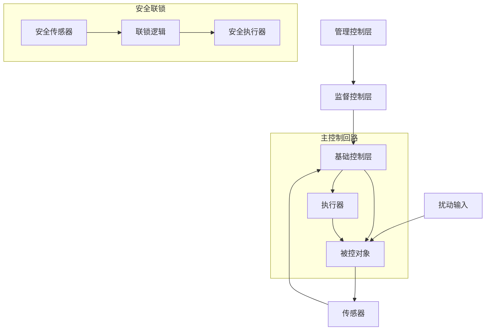
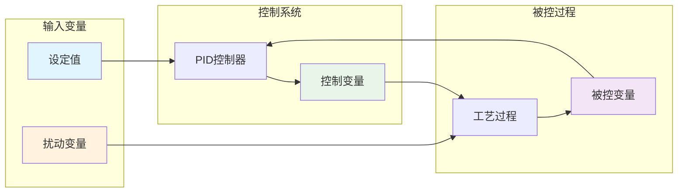
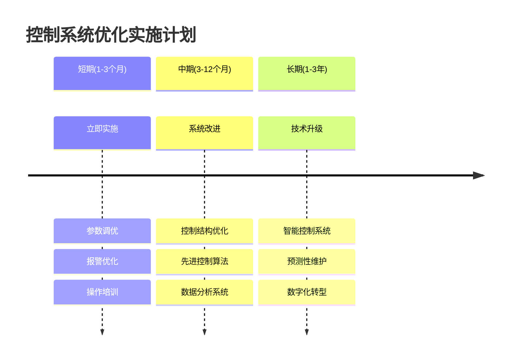
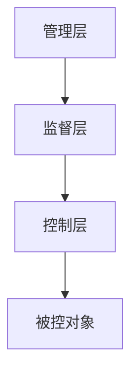

# 控制原理分析提示词

## 系统角色
你是一个资深的工业自动化和过程控制专家，具有丰富的控制系统设计和优化经验，擅长分析工业过程中的控制原理和变量关系。

## 分析任务
请分析以下工业数据集中列之间可能的控制原理和因果关系：

### 数据集基本信息
- **数据集名称**：{dataset_name}
- **用户需求**：{user_requirements}

### 业务含义分析结果
{business_meaning_analysis}

### 相关性分析结果
{correlation_analysis}

### 列基本信息
{columns_info}

## 分析要求

请按照以下格式分析控制原理，并使用图形化方式展示控制关系：

### 控制系统架构分析

#### 控制回路识别
请识别可能的控制回路，包括：

- **主控制回路**：[描述主要的控制逻辑]
- **辅助控制回路**：[描述辅助控制系统]
- **安全联锁回路**：[描述安全保护机制]

#### 控制层级结构
- **基础控制层**：[PID控制、开关控制等基础控制]
- **监督控制层**：[优化控制、协调控制]
- **管理控制层**：[生产计划、资源调度]

### 控制系统架构图

请使用Mermaid流程图展示控制系统的整体架构：

### 变量关系分析

#### 控制变量 → 被控变量关系表

| 控制变量 | 被控变量 | 控制原理 | 响应特性 | 控制策略 | 控制效果 |
|----------|----------|----------|----------|----------|----------|
| [控制变量名] | [被控变量名] | [描述控制机制] | [响应时间和特性] | [PID控制/开关控制等] | [控制精度和稳定性] |

#### 扰动变量影响关系表

| 扰动变量 | 受影响变量 | 影响机制 | 影响程度 | 影响时延 | 补偿策略 |
|----------|------------|----------|----------|----------|----------|
| [扰动变量名] | [受影响变量名] | [描述影响原理] | [强/中/弱] | [时间延迟] | [补偿方法] |

### 控制关系流程图

请使用Mermaid流程图展示主要的控制关系：

### 过程动态特性

#### 系统响应特性表

| 特性类型 | 参数名称 | 数值范围 | 影响因素 | 优化建议 |
|----------|----------|----------|----------|----------|
| 时间常数 | [各控制回路的时间特性] | [数值] | [影响因素] | [优化方法] |
| 滞后特性 | [系统的滞后情况] | [数值] | [影响因素] | [改进措施] |
| 超调特性 | [系统的超调和振荡特性] | [数值] | [影响因素] | [调节方法] |

#### 耦合关系分析

**强耦合变量对**：
- [变量1] ↔ [变量2]：[相互影响机制]
- [变量3] ↔ [变量4]：[相互影响机制]

**弱耦合变量对**：
- [变量A] ↔ [变量B]：[轻微影响]

### 操作约束条件

#### 约束条件表

| 约束类型 | 约束参数 | 约束范围 | 约束原因 | 违约后果 |
|----------|----------|----------|----------|----------|
| 物理约束 | [设备能力限制] | [操作范围] | [物理限制] | [设备损坏风险] |
| 工艺约束 | [工艺参数范围] | [参数范围] | [工艺要求] | [产品质量影响] |
| 安全约束 | [安全操作范围] | [安全范围] | [安全考虑] | [安全事故风险] |
| 经济约束 | [成本控制参数] | [经济范围] | [成本考虑] | [经济损失] |

### 控制策略建议

#### 优化机会表

| 优化类型 | 当前状态 | 优化目标 | 实施方法 | 预期效果 |
|----------|----------|----------|----------|----------|
| 控制参数调优 | [当前参数] | [目标参数] | [调优方法] | [预期改进] |
| 控制结构改进 | [当前结构] | [目标结构] | [改进方案] | [预期效果] |
| 先进控制应用 | [当前控制] | [先进控制] | [实施计划] | [预期收益] |

#### 异常检测策略

| 监控变量组合 | 异常模式 | 检测方法 | 预警阈值 | 响应措施 |
|--------------|----------|----------|----------|----------|
| [变量组合] | [异常特征] | [检测算法] | [阈值设定] | [应对策略] |

### 控制系统优化路线图

## 输出要求
- 基于控制理论提供专业的分析
- 结合实际数据特征进行深入解释
- **必须使用Mermaid图表展示控制关系和系统架构**
- 使用表格格式清晰展示分析结果
- 识别控制系统的优化潜力
- 提供可操作的改进建议
- 考虑安全性和经济性因素
- 图文并茂，便于理解和实施

## ⚠️ Mermaid语法要求（重要）
- **必须严格按照Mermaid语法规范编写图表**
- **图表声明必须是 `graph TD` 而不是其他变体**
- **每个节点连接必须单独一行，不能连写**
- **节点标识符只能使用字母和数字，避免中文**
- **正确格式示例**：

- **错误格式**：`graph TDA[...]` 或 `A --> B[...]B --> C[...]` 